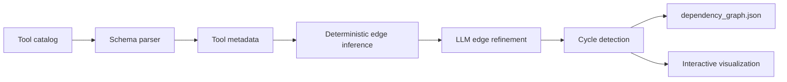

# ToolGraph

ToolGraph generates an executable dependency graph from a catalog of API tools. It identifies which tools can produce the inputs required by other tools, creating a machine-readable map that an AI agent can use to plan multi-step actions.

For example, commenting on a GitHub issue requires an `issue_number`. ToolGraph can connect an issue-listing or issue-creation tool to the comment tool because the first operation produces the value required by the second.

The generator combines deterministic schema analysis with optional LLM-based refinement, removes cycles, writes the final graph as JSON, and produces an interactive browser visualization.

## Why This Exists

Tool-using agents frequently know *what* action to execute but not *how to obtain* every required argument. Without dependency information, an agent must either ask the user for values it could discover itself or guess which prerequisite action to call.

ToolGraph turns a flat tool catalog into planning infrastructure:

- **Nodes** represent available tools.
- **Edges** represent producer-to-consumer relationships.
- **Edge labels** identify the value passed between tools.

This makes questions such as these answerable before execution:

- Which tool can supply a missing `issue_number`?
- What must run before a pull request can be merged?
- Can the agent build a valid sequence without asking the user for more information?
- Does the inferred workflow contain a dependency cycle?

## Sample Results

Running ToolGraph against the included GitHub catalog currently produces:

| Metric | Result |
| --- | ---: |
| Catalog size | 7.7 MB |
| Tools represented | 893 |
| Labeled dependency edges | 2,495 |
| Node provenance | 100% |
| Automated tests | 9 |

Node provenance means every generated node maps back to a tool slug in the source catalog. It does not, by itself, measure the semantic precision of every inferred edge; see [Limitations](#limitations).

## How It Works



### 1. Parse the catalog

The parser extracts each tool's:

- slug and description
- required input parameters
- input types and descriptions
- output fields, including fields nested behind JSON Schema `$ref` and `$defs`

The generator reads the catalog supplied at runtime rather than relying on a hand-written GitHub graph.

### 2. Separate user inputs from generated inputs

Common values such as repository names, pagination settings, titles, and message bodies are treated as static or user-provided parameters. Entity identifiers such as `issue_number`, `pull_number`, and `deployment_id` are treated as potential runtime dependencies.

This prevents the graph from connecting tools merely because they both mention generic configuration fields.

### 3. Infer candidate dependencies

The deterministic inference engine compares required consumer inputs with producer outputs. It uses:

- normalized field-name matching
- identifier-aware matching for `_id` and `_number` fields
- tool-domain constraints
- producer-action classification such as `GET`, `LIST`, `CREATE`, and `SEARCH`
- sub-entity checks that reduce matches such as treating a comment ID as an issue ID

Each accepted relationship is emitted as:

```text
producer tool --[required field]--> consumer tool
```

### 4. Refine ambiguous edges with an LLM

When AI credentials are configured, candidate producers are summarized and sent to an OpenAI-compatible model using JSON output mode. The model filters relationships using tool descriptions, output fields, and the semantic meaning of each required parameter.

The LLM does not directly invent the entire graph. It operates on deterministic candidates, keeping the result grounded in the supplied catalog and making failures easier to inspect.

If model refinement fails after initialization, the generator retains the deterministic result rather than discarding the graph.

### 5. Remove cycles

A depth-first traversal identifies back edges and removes them before serialization. The resulting directed acyclic graph is safer to use as the basis for sequential agent planning.

### 6. Generate an interactive visualization

The browser visualization uses `vis-network` and includes:

- directed, labeled dependency edges
- domain-based node colors
- search and autocomplete
- repeated-search cycling across matching tools
- zooming, panning, selection, and focus controls
- live node and edge counts

## Example Output

```json
{
  "nodes": [
    {
      "id": "GITHUB_LIST_REPOSITORY_ISSUES"
    },
    {
      "id": "GITHUB_CREATE_AN_ISSUE_COMMENT"
    }
  ],
  "edges": [
    {
      "from": "GITHUB_LIST_REPOSITORY_ISSUES",
      "to": "GITHUB_CREATE_AN_ISSUE_COMMENT",
      "label": "issue_number"
    }
  ]
}
```

The direction is always `producer -> consumer`. The label is the value supplied by the producer.

## Tech Stack

- **TypeScript** for catalog parsing, inference, validation, and generation
- **OpenAI-compatible API** for semantic edge refinement
- **Node.js test runner** for automated testing
- **Vis Network** for interactive graph rendering
- **JSON Schema** for input and output analysis

## Repository Structure

```text
dep-graph/
├── src/
│   ├── generate.ts       # Parser, inference engine, LLM refinement, DAG logic, and visualizer
│   ├── generate.test.ts  # Unit tests for core behavior
│   └── selfcheck.ts      # End-to-end output and provenance checks
├── github_catalog.json   # Example GitHub tool catalog
├── generator.json        # Build and execution contract
├── visualization.html    # Generated interactive graph
├── package.json
└── README.md
```

`dependency_graph.json` is generated locally and is not required to be committed.

## Getting Started

### Prerequisites

- Node.js 20 or newer
- npm
- An OpenAI-compatible API key and base URL for LLM refinement

### Installation

```bash
git clone https://github.com/tarun05rawat/dep-graph.git
cd dep-graph
npm install
```

Create a `.env` file in the repository root:

```env
OPENAI_API_KEY=your_api_key
OPENAI_BASE_URL=https://your-openai-compatible-endpoint.example/v1
```

If the provider uses OpenAI's default endpoint, `OPENAI_BASE_URL` can be omitted.

### Generate a graph

```bash
npm run generate -- github_catalog.json
```

This writes:

- `dependency_graph.json`
- `visualization.html`

The generator accepts any compatible catalog path:

```bash
npm run generate -- path/to/toolkit_catalog.json
```

### Open the visualization

Open `visualization.html` in a browser. The page loads the generated nodes and edges directly, so a separate frontend server is not required.

## Validation and Testing

Run the unit tests:

```bash
npm test
```

The test suite covers:

- tool metadata extraction
- recursive `$defs` schema resolution
- static and dynamic parameter classification
- heuristic dependency inference
- domain classification
- mocked LLM refinement
- visualization generation
- cycle detection and removal
- structured JSON cleanup

Run the end-to-end self-check:

```bash
npm run selfcheck
```

The self-check regenerates the graph and reports:

- node count
- edge count
- catalog provenance ratio
- labeled-edge count

## Design Decisions

### Deterministic inference before model inference

Schema matching provides a reproducible baseline and constrains model input. The LLM is used where semantic judgment helps, not as a replacement for catalog parsing or graph algorithms.

### Catalog-grounded identifiers

Node IDs come directly from tool slugs in the source catalog. This avoids hallucinated tools and makes every node traceable to its definition.

### Explainable relationships

Every edge records both its producer and consumer plus the exact field being transferred. A developer can inspect why two tools were connected without reconstructing hidden model reasoning.

### Graceful refinement fallback

The graph can retain deterministic candidates when model refinement encounters a runtime error, keeping generation useful even when the model provider is unavailable during processing.

## Limitations

- Domain and producer classification currently rely partly on naming conventions.
- LLM refinement filters deterministic candidates; it does not yet add entirely new relationships missed by the heuristic stage.
- The included self-check validates structure and provenance, not complete semantic precision or recall.
- Cycle removal is based on traversal order rather than learned edge confidence.
- The sample catalog is GitHub-heavy; broader evaluation across unrelated toolkits would better test generalization.
- Large graphs can become visually dense even with search and domain coloring.

## Roadmap

- Add a hand-labeled evaluation set with edge precision, recall, and F1 metrics.
- Lazy-load the model client so deterministic generation can run without AI credentials.
- Add confidence scores and provenance metadata to every edge.
- Rank competing producer tools by semantic fit and execution cost.
- Support additional schema variants such as `oneOf`, `anyOf`, and deeply nested arrays.
- Evaluate generalization on communication, CRM, calendar, and database toolkits.
- Export GraphML or DOT for analysis in external graph tools.
- Generate executable multi-tool plans from the dependency graph.

## What This Project Demonstrates

ToolGraph combines several concerns that usually appear separately:

- graph construction and cycle detection
- recursive JSON Schema processing
- hybrid deterministic and LLM-based reasoning
- structured model outputs and failure handling
- automated testing and output validation
- interactive visualization of a large generated artifact

The project is intended as a foundation for more reliable tool-using agents: systems that can discover prerequisite actions, explain their plans, and reduce unnecessary questions before execution.

## License

No license has been added yet. All rights are reserved unless a license is added in a future release.
